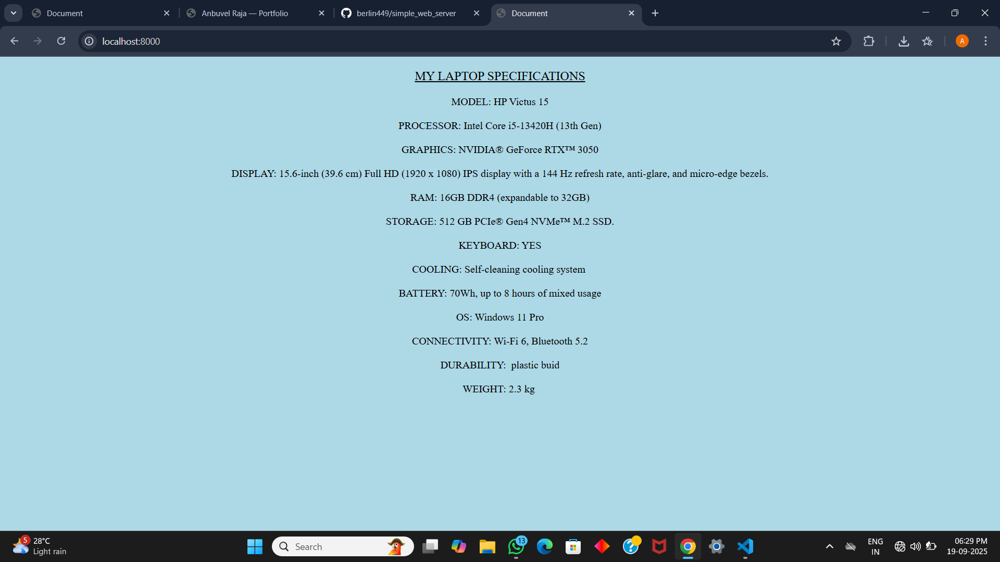
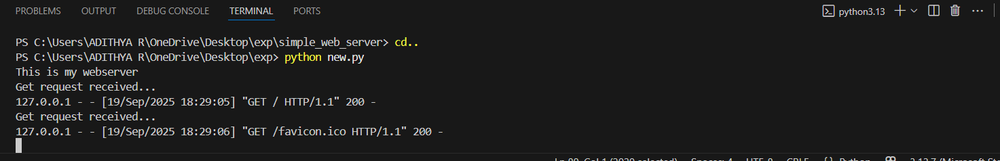

# EX01 Developing a Simple Webserver

# Date:19-09-2025
# AIM:
To develop a simple webserver to serve html pages and display the configuration details of laptop.

# DESIGN STEPS:
## Step 1:
HTML content creation.

## Step 2:
Design of webserver workflow.

## Step 3:
Implementation using Python code.

## Step 4:
Serving the HTML pages.

## Step 5:
Testing the webserver.

# PROGRAM:
```from http.server import BaseHTTPRequestHandler,HTTPServer
content ='''
<!DOCTYPE html>
<html lang="en">
<head>
    <meta charset="UTF-8">
    <meta name="viewport" content="width=device-width, initial-scale=1.0">
    <title>Document</title>
    <style>
        
        *{
            font-family: 'Times New Roman';
        }
            .head{
            text-align: center;
            font-size: larger;
            font-weight: 300;
            text-decoration: underline;
            
        }
    </style>
</head>
<body bgcolor="lightblue" text="black">

<CENTER>
    <p class="head">MY LAPTOP SPECIFICATIONS</p>
    <pre>
MODEL: HP Victus 15

PROCESSOR: Intel Core i5-13420H (13th Gen)

GRAPHICS: NVIDIA® GeForce RTX™ 3050

DISPLAY: 15.6-inch (39.6 cm) Full HD (1920 x 1080) IPS display with a 144 Hz refresh rate, anti-glare, and micro-edge bezels.
 
RAM: 16GB DDR4 (expandable to 32GB)

STORAGE: 512 GB PCIe® Gen4 NVMe™ M.2 SSD.

KEYBOARD: YES

COOLING: Self-cleaning cooling system 

BATTERY: 70Wh, up to 8 hours of mixed usage

OS: Windows 11 Pro

CONNECTIVITY: Wi-Fi 6, Bluetooth 5.2

DURABILITY:  plastic buid

WEIGHT: 2.3 kg 
</pre>
</CENTER>
</body>
</html>
'''
class MyServer(BaseHTTPRequestHandler):
    def do_GET(self):
        print("Get request received...")
        self.send_response(200)
        self.send_header("content-type", "text/html")
        self.end_headers()
        self.wfile.write(content.encode())
print("This is my webserver")
server_address =('',8000)
httpd = HTTPServer(server_address,MyServer)
httpd.serve_forever()
class Myserver(BaseHTTPRequestHandler):
    def do_GET(self):
        print("Get request received...")
        self.send_response(200)
        self.send_header("content-type","text/html")
        self.end_headers()
        self.wfile.write(content.encode())
print("This is my webserver")
server_address =('',8000)
httpd = HTTPServer(server_address,Myserver)
httpd.serve_forever()
```

# OUTPUT:




# RESULT:
The program for implementing simple webserver is executed successfully.
